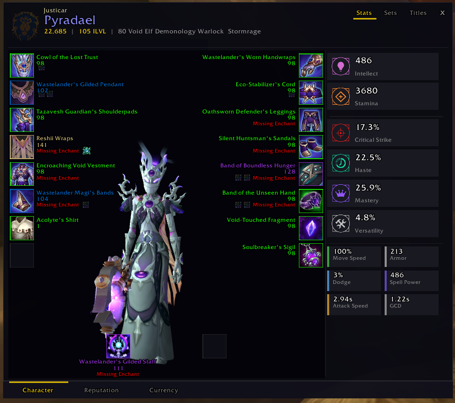
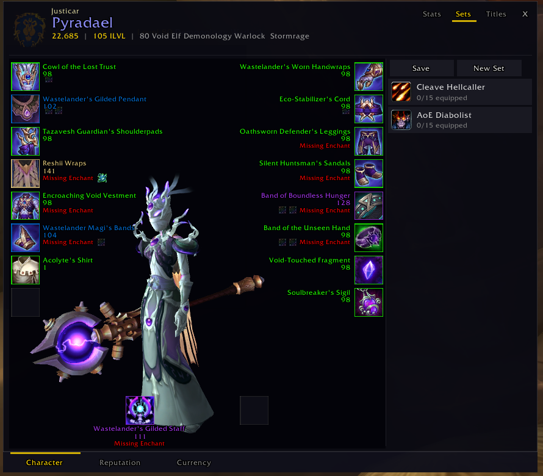
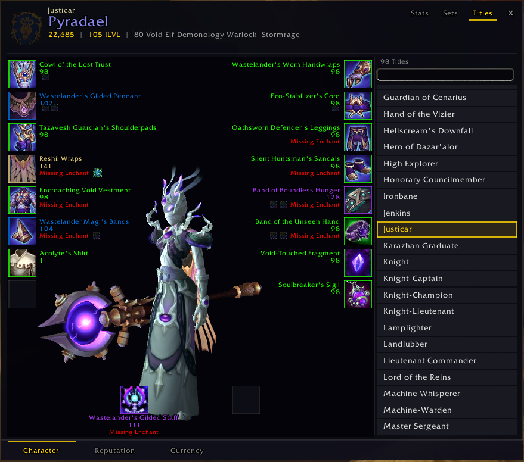
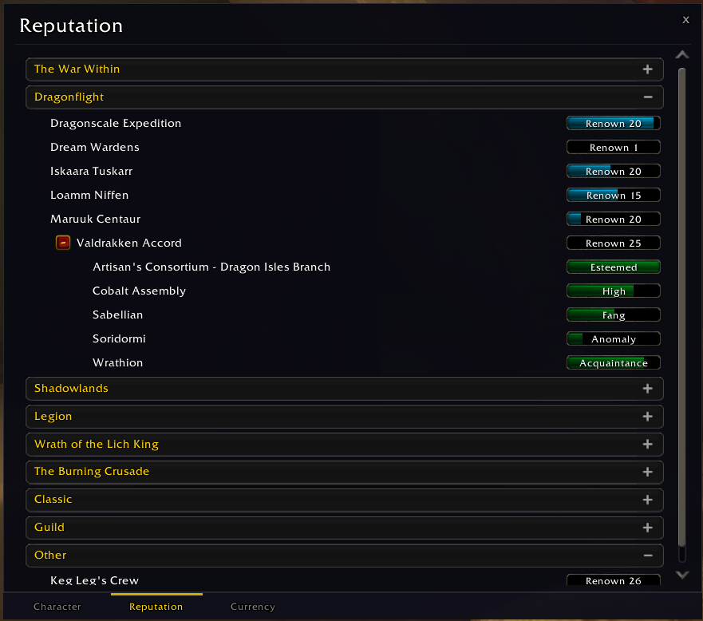

# ProfilePanel

A World of Warcraft addon that replaces the default character sheet with a clean, dark, armory-inspired UI. Built from scratch for Retail (The War Within).

Inspired by [ChonkyCharacterSheet](https://github.com/draeginia/ChonkyCharacterSheet) and the [WoW Armory](https://worldofwarcraft.com/) character profile pages.

## Screenshots

### Character Panel — Stats



Full 3D character model with equipment slots overlaid on both sides. The right panel shows stats using armory-style diamond icons across three tiers: primary stats, secondary percentages, and a compact two-column layout for tertiary stats. Missing enchants and empty gem sockets are called out in red.

### Character Panel — Gear Sets



Manage equipment sets directly from the character panel. Save, create, rename (right-click), and delete sets. Drag sets to action bars. The currently equipped set is highlighted in gold.

### Character Panel — Titles



Browse and apply titles with a searchable, scrollable list. The active title is highlighted. Click any title to apply it instantly.

### Reputation



Clean dark overlay for the reputation panel, replacing the default Blizzard chrome while preserving all native functionality.

### Currency


Same treatment for the currency panel — dark, minimal, consistent with the rest of the UI.

## Features

- **Armory-style character header** — Title, name, achievement points, item level, level/race/spec/class, guild, and realm
- **3D character model** — Draggable rotation, atmospheric lighting, vignette effect
- **Equipment overlay** — Item name, item level, enchant status, and gem sockets displayed alongside the model. Missing enchants/gems highlighted in red. Drag-and-drop, shift-click to link, ctrl-click to preview
- **Stat icons** — Diamond-shaped icons inspired by the WoW Armory website, colored per stat type
- **Three-tier stat layout** — Primary stats (large cards), secondary stats (medium cards), tertiary/minor stats (compact two-column grid). Hover tooltips show full breakdowns for multi-value stats like Versatility and Armor
- **Gear Sets** — Create, save, rename, delete equipment sets. Drag to action bars
- **Titles** — Searchable title list with instant application
- **Reputation & Currency** — Dark-themed overlays that wrap Blizzard's native panels
- **Bottom tab bar** — Character / Reputation / Currency navigation
- **Zero dependencies** — No libraries required

## Installation

1. Download or clone this repository
2. Place the `ProfilePanel` folder in your WoW addons directory:
   ```
   World of Warcraft/_retail_/Interface/AddOns/ProfilePanel
   ```
3. Restart WoW or `/reload`

The addon hooks into the default character panel — just press `C` to open it.

## Project Structure

```
ProfilePanel/
├── core/
│   ├── core.lua          # Namespace, constants, slot layout, stat colors
│   ├── events.lua        # Event system, lifecycle events, stat update dispatch
│   └── api.lua           # Stat definitions, GetSlotInfo(), enchant/gem detection
├── ui/
│   ├── frame.lua         # Main frame, Blizzard chrome hiding, tab bar, rep/currency overlay
│   ├── header.lua        # Character header (name, ilvl, spec, guild, etc.)
│   ├── tabs.lua          # Right-panel tab system (Stats/Sets/Titles), gear set & title UI
│   ├── model.lua         # 3D character model with rotation and atmospheric lighting
│   ├── equipment.lua     # Custom equipment slot display with interaction handlers
│   └── stats.lua         # Stat cards with tiered layout and diamond icons
├── Media/
│   └── Textures/         # Stat icon PNGs (armory-style diamonds)
├── images/               # Screenshots
└── ProfilePanel.toc      # Addon manifest
```

## Design Goals

- **Dark and minimal** — No ornate borders, no portrait orb, no Blizzard chrome
- **Information-dense but readable** — Everything visible at a glance without scrolling
- **Armory-inspired** — Stat icons, layout, and color language drawn from the WoW website
- **Lightweight** — Pure Lua, no external libraries, no saved variable bloat
- **Non-destructive** — Blizzard UI is hidden, not destroyed. Disable the addon and everything reverts

## Known Issues

- Right-click context menu for equipping bag items doesn't work on some left-side equipment slots (investigating Blizzard frame event interaction)
- This is an early proof of concept (v0.1.0) — expect rough edges

## Status

This is an **alpha proof of concept**. The core feature set works but there's plenty to polish. Contributions and feedback welcome.

## License

MIT
